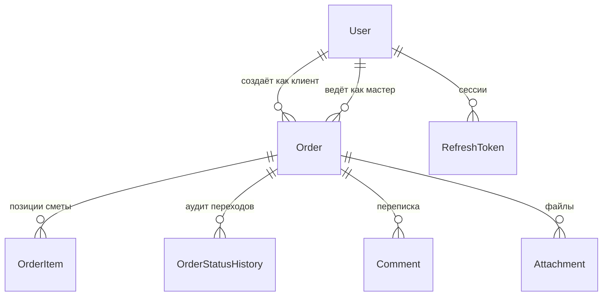

# RepairFlow

Система учёта заявок для сервисного центра по ремонту техники: клиент оставляет заявку, мастер ведёт ремонт и смету, менеджер видит всю мастерскую целиком.

**[Живое демо](#)** · заходить можно одной кнопкой — на странице входа есть три демо-аккаунта:
клиент, мастер и менеджер (`manager@demo.io` / `master@demo.io` / `client@demo.io`, пароль `demo1234`).

Как всё это разворачивается — в [DEPLOY.md](DEPLOY.md).

## Возможности

- Клиент оставляет заявку с фотографиями поломки и видит статус ремонта в реальном времени — карточка обновляется сама, без перезагрузки.
- Мастер собирает смету из работ и запчастей, а клиент подтверждает или отклоняет её онлайн.
- Заявка живёт по понятному маршруту: новая → диагностика → согласование сметы → ремонт → выдача, и никто не может его перепрыгнуть.
- Менеджер назначает мастеров, видит загрузку каждого и выручку за период.
- Переписка по заявке ведётся прямо в карточке, а внутренние заметки мастеров клиенту не видны — ни в API, ни в живых событиях.
- Любое изменение статуса попадает в историю: видно, кто, когда и почему передвинул заявку.
- Фильтры списка живут в адресной строке — ссылку на отобранные заявки можно просто переслать коллеге.

## Стек

**Бэкенд:** ASP.NET Core 10 · EF Core 10 · PostgreSQL 16 · JWT с refresh-токенами · SignalR · MessagePack · FluentValidation · OpenAPI + Scalar
**Фронтенд:** Vue 3 + TypeScript · Pinia · Vue Router · Tailwind CSS · Vite
**Инфраструктура:** Docker Compose · xUnit v3

## Архитектура

```
Controllers   — тонкие: разбирают запрос, отдают DTO, ни одного try/catch
Services      — вся бизнес-логика и работа с EF Core
Domain        — сущности и чистая логика: машина состояний, расчёт сметы, номера заявок
Data          — DbContext, конфигурации сущностей, ограничение выборки по роли
Authorization — политики и resource-based requirements
Realtime      — SignalR-хаб и рассылка событий по заявке
Serialization — единая настройка MessagePack для HTTP, SignalR и кеша
```

Сквозные механизмы вынесены на края: валидация — фильтр с FluentValidation, ошибки — один middleware, превращающий исключение в `ProblemDetails` (RFC 7807).



Жизненный цикл заявки:

```
Новая → Диагностика → Ожидает подтверждения сметы → В работе → Готова к выдаче → Выдана
                              ↓                ↓
                        Отказ клиента      Отменена
```

## Запуск

```bash
docker compose up --build
```

Дальше:

- API и документация — http://localhost:5080 (Scalar по `/scalar/v1`, схема по `/openapi/v1.json`)
- PostgreSQL — localhost:5433 (`repairflow` / `repairflow`)
- База поднимается, схема создаётся, демо-данные наливаются автоматически.

### Локально без Docker

```bash
# 1. Только база
docker compose up -d db

# 2. Строка подключения и секрет JWT
export ConnectionStrings__Default="Host=localhost;Port=5433;Database=repairflow;Username=repairflow;Password=repairflow"

# 3. Миграции (нужны один раз, инструмент ставится глобально)
dotnet tool install --global dotnet-ef
dotnet ef migrations add InitialCreate \
  --project backend/src/RepairFlow.Api \
  --output-dir Data/Migrations

# 4. Запуск
dotnet run --project backend/src/RepairFlow.Api
```

Приложение применяет миграции само при старте. Если миграций в репозитории ещё нет, схема создаётся напрямую — демо поднимется в любом случае.

### Фронтенд

```bash
cd frontend
npm install
npm run dev          # http://localhost:5173
```

### Тесты

```bash
dotnet test backend/RepairFlow.sln   # логика домена и сериализация
cd frontend && npm run build          # типы фронтенда проверяются сборкой
```

### Продакшн

База — [Neon](https://neon.com) (бесплатный план, обычный PostgreSQL), бэкенд — контейнер на Render,
фронтенд — Vercel. Схема и демо-данные создаются при первом старте приложения, отдельный шаг не нужен.

Переменные окружения бэкенда:

| Переменная | Значение |
|---|---|
| `ConnectionStrings__Default` | строка подключения Neon в формате Npgsql |
| `Jwt__Key` | случайный секрет от 32 символов |
| `Jwt__CrossSiteCookies` | `true` — фронт и API живут на разных доменах |
| `Cors__Origins__0` | адрес фронтенда на Vercel |
| `ASPNETCORE_ENVIRONMENT` | `Production` |

Строка подключения к Neon для Npgsql выглядит так:

```
Host=<endpoint>-pooler.<region>.aws.neon.tech;Database=neondb;Username=neondb_owner;Password=<пароль>;SSL Mode=Require;Channel Binding=Require;Maximum Pool Size=10;No Reset On Close=true
```

`No Reset On Close` нужен, потому что Neon отдаёт соединения через PgBouncer в transaction-режиме.

Секреты в репозиторий не коммитятся — только в переменные окружения площадки.

## Что внутри интересного

**Машина состояний заявки.** Граф переходов и права ролей на них описаны одной таблицей в `OrderStatusMachine`. Клиент может только подтвердить смету, отклонить её и отменить ещё не принятую заявку; всё остальное — мастер и менеджер. Фронтенд не гадает, какие кнопки рисовать: сервер отдаёт список доступных переходов вместе с карточкой заявки.

**Авторизация на уровне запроса к базе.** Клиент видит свои заявки, мастер — назначенные ему и свободные, менеджер — все. Условие уезжает в SQL (`OrderQueryScope`), а не фильтрует уже загруженный список: лишние строки не покидают базу. То же правило (`OrderAccessHandler.IsGranted`) переиспользуется в SignalR-хабе, поэтому подписка на заявку не становится обходным путём к чужим данным.

**MessagePack в трёх местах сразу.** Один резолвер обслуживает три канала:

| Канал | Как включается | Зачем |
|---|---|---|
| REST-ответы | заголовок `Accept: application/x-msgpack` | клиенту с дорогим трафиком — компактный бинарный ответ, всем остальным по-прежнему JSON |
| SignalR | `AddMessagePackProtocol()` | события заявки летят бинарным протоколом, а не JSON-конвертами |
| Кеш дашборда | `MessagePackCacheStore` поверх `IDistributedCache` | сериализация с LZ4: сводка со списками по дням занимает в разы меньше |

Enum'ы в обоих форматах едут строками, а `DateOnly` — датой ISO-8601 через собственный форматтер, поэтому JSON и MessagePack описывают ровно один и тот же контракт.

**Живые обновления.** Хаб `/hubs/orders` рассылает смену статуса, назначение мастера и новые комментарии. Внутренние заметки уходят в отдельную группу — клиент их не получает даже здесь. Падение рассылки не роняет запрос: уведомление вне транзакции.

**Refresh-токены с ротацией.** Access живёт 15 минут, refresh — 7 дней в httpOnly-куке, недоступной из JavaScript. При обновлении старый токен отзывается, а повторная попытка использовать отозванный гасит все сессии пользователя: так обнаруживается кража. Для WebSocket токен принимается query-параметром, но только на адресе хаба.

**Номер заявки.** `RF-2026-0001` — последовательный в рамках года. Выдаётся под advisory-блокировкой Postgres, поэтому два одновременных запроса не получат одинаковый номер.

**Зависимости под аудитом.** `NuGetAudit` включён в режиме `all` с порогом `low`: restore сверяет весь граф, включая транзитивные пакеты, с базой GitHub Advisories. Одна находка уже закрыта — `Microsoft.AspNetCore.OpenApi` тянет за собой `Microsoft.OpenApi 2.0.0` с [GHSA-v5pm-xwqc-g5wc](https://github.com/advisories/GHSA-v5pm-xwqc-g5wc), поэтому в проекте стоит прямая ссылка на исправленную 2.7.5.

**Деньги считаются отдельно.** Расчёт сметы вынесен в чистую функцию и покрыт тестами: округляется каждая строка, а не итог — как в бумажном счёте.

## Структура репозитория

```
backend/
  RepairFlow.sln
  src/RepairFlow.Api          ASP.NET Core 10 Web API
  tests/RepairFlow.Tests      юнит-тесты домена и сериализации
frontend/                     Vue 3 + TypeScript + Tailwind
docs/                         скриншоты, gif, дизайн-система
.github/workflows/            сборка и тесты на каждый push
docker-compose.yml            Postgres + API одной командой
render.yaml                   блюпринт деплоя API
DEPLOY.md                     как поднять демо с нуля
```

## API

Полное описание — в Scalar по адресу http://localhost:5080/scalar/v1. Коротко:

| Метод | Путь | Что делает |
|---|---|---|
| POST | `/api/auth/login` | вход, access в теле + refresh в httpOnly-куке |
| POST | `/api/auth/demo` | вход в демо-аккаунт одной кнопкой |
| POST | `/api/auth/refresh` | тихое обновление пары токенов |
| GET | `/api/orders` | список с фильтрами, поиском, сортировкой и пагинацией |
| POST | `/api/orders` | создание заявки клиентом |
| POST | `/api/orders/{id}/status` | смена статуса с валидацией перехода |
| POST | `/api/orders/{id}/assign` | назначение мастера |
| GET | `/api/orders/{id}/history` | история переходов |
| POST | `/api/orders/{id}/items` | позиция сметы |
| POST | `/api/orders/{id}/estimate/approve` | клиент подтверждает смету |
| POST | `/api/orders/{id}/attachments` | загрузка файла, 10 МБ, whitelist типов |
| GET | `/api/dashboard/summary` | аналитика для менеджера |
| WS | `/hubs/orders` | живые события заявки, протокол MessagePack |

Любой GET умеет отдавать MessagePack:

```bash
curl -H "Accept: application/x-msgpack" \
     -H "Authorization: Bearer $TOKEN" \
     http://localhost:5080/api/orders --output orders.msgpack
```
