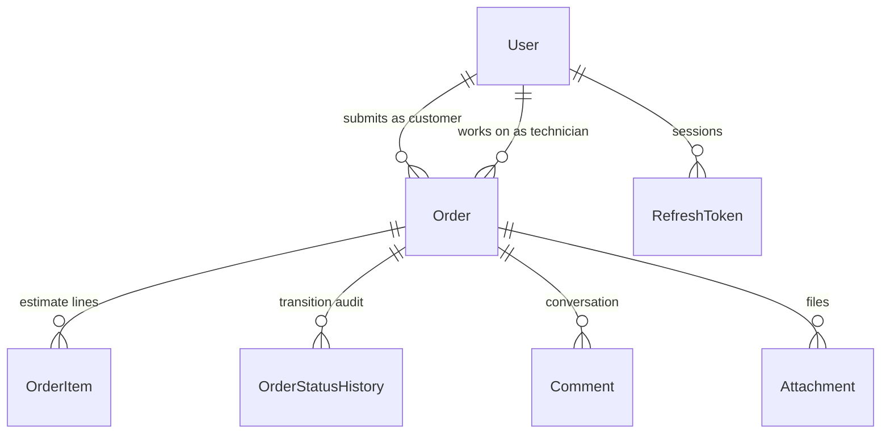

# RepairFlow

Job management for a device repair shop: customers submit repair requests and watch them progress,
technicians run diagnostics and build cost estimates, managers see the whole workshop at a glance.

*[По-русски](README.ru.md)*

**[Live demo](https://repair-flow-ruddy.vercel.app)** — one click, no signup. The login page has three
demo accounts: customer, technician and manager (`client@demo.io` / `master@demo.io` /
`manager@demo.io`, password `demo1234`).

> The demo runs on free tiers. If the API has been idle, the first request wakes it up and can take
> up to a minute — the login page tells you when that is happening.

## What it does

- A customer submits a request with photos of the fault and follows the repair in real time — the
  card updates itself, no refresh needed.
- The technician builds an estimate from parts and labour; the customer approves or declines it online.
- Every request follows one route — new → diagnostics → estimate approval → in progress → ready →
  handed over — and nobody can skip a step.
- The manager assigns technicians, sees each one's workload and the revenue for a period.
- Customer and technician talk inside the request; internal notes stay invisible to the customer.
- Every status change is recorded: who moved it, when, and why.
- List filters live in the URL, so a filtered view can simply be sent to a colleague.

## Stack

**Backend:** ASP.NET Core 10 · EF Core 10 · PostgreSQL 18 · JWT with refresh tokens · SignalR ·
MessagePack · FluentValidation · OpenAPI + Scalar
**Frontend:** Vue 3 + TypeScript · Pinia · Vue Router · Tailwind CSS 4 · Vite
**Infrastructure:** Docker Compose · xUnit v3 · GitHub Actions · Neon · Render · Vercel

## Architecture

```
Controllers   thin: parse the request, return a DTO, not a single try/catch
Services      business logic and EF Core
Domain        entities and pure logic: state machine, estimate maths, request numbering
Data          DbContext, entity configuration, role-based query scoping
Authorization policies and resource-based requirements
Realtime      SignalR hub and request event fan-out
Serialization one MessagePack setup shared by HTTP, SignalR and the cache
```

Cross-cutting concerns sit at the edges: validation is a filter backed by FluentValidation, errors
are one middleware that turns any exception into `ProblemDetails` (RFC 7807).



Request lifecycle:

```
New → Diagnostics → Awaiting estimate approval → In progress → Ready for pickup → Handed over
                            ↓                  ↓
                     Customer declined      Cancelled
```

## Running it

```bash
docker compose up --build
```

- API and docs — http://localhost:5080 (Scalar at `/scalar/v1`, schema at `/openapi/v1.json`)
- PostgreSQL — localhost:5433 (`repairflow` / `repairflow`)
- The schema is created and demo data is seeded automatically on first start.

### Without Docker

```bash
docker compose up -d db

export ConnectionStrings__Default="Host=localhost;Port=5433;Database=repairflow;Username=repairflow;Password=repairflow"

dotnet run --project backend/src/RepairFlow.Api
```

### Frontend

```bash
cd frontend
npm install
npm run dev          # http://localhost:5173
```

### Tests

```bash
dotnet test backend/RepairFlow.sln   # domain logic and serialization
cd frontend && npm run build          # frontend types are checked by the build
```

## Things worth a look

**The request state machine.** The transition graph and the roles allowed to walk it are one table in
`OrderStatusMachine`. A customer may only approve an estimate, decline it, or cancel a request that
hasn't been accepted yet; everything else belongs to technicians and managers. The frontend doesn't
guess which buttons to render — the server returns the list of available transitions with the request.

**Authorization pushed down to the query.** Customers see their own requests, technicians see the ones
assigned to them plus the unassigned pool, managers see everything. The condition goes into the SQL
(`OrderQueryScope`) rather than filtering an already-loaded list, so rows that aren't yours never leave
the database. The same rule (`OrderAccessHandler.IsGranted`) is reused by the SignalR hub, so
subscribing to a request is not a way around it.

**MessagePack in three places at once.** One resolver serves three channels:

| Channel | How it turns on | Why |
|---|---|---|
| REST responses | `Accept: application/x-msgpack` | a compact binary reply for clients that pay for traffic; everyone else still gets JSON |
| SignalR | `AddMessagePackProtocol()` | request events travel as binary frames instead of JSON envelopes |
| Dashboard cache | `MessagePackCacheStore` over `IDistributedCache` | LZ4-compressed: the summary with its per-day series takes a fraction of the space |

Enums travel as strings in both formats and `DateOnly` as an ISO-8601 date through a custom formatter,
so JSON and MessagePack describe exactly the same contract.

**Live updates.** The `/hubs/orders` hub broadcasts status changes, technician assignment and new
comments. Internal notes go to a separate group, so the customer never receives them. A failed
broadcast doesn't fail the request — notifications live outside the transaction.

**Refresh tokens with rotation.** The access token lives 15 minutes, the refresh token 7 days in an
httpOnly cookie that JavaScript cannot read. Rotating revokes the old token, and reusing a revoked one
kills every session of that user — that is how theft is detected. WebSocket connections pass the token
as a query parameter, accepted only on the hub path.

**Request numbers.** `RF-2026-0001`, sequential within the year, issued under a Postgres advisory lock
so two concurrent submissions can never collide.

**Money is computed apart from everything else.** Estimate maths lives in a pure function covered by
tests: each line is rounded, not the total — the way a paper invoice works.

**Dependencies are audited.** `NuGetAudit` runs in `all` mode with a `low` threshold, so restore checks
the whole transitive graph against the GitHub Advisory Database.

## Repository layout

```
backend/
  RepairFlow.sln
  src/RepairFlow.Api          ASP.NET Core 10 Web API
  tests/RepairFlow.Tests      domain and serialization tests
frontend/                     Vue 3 + TypeScript + Tailwind
docs/                         screenshots, design system
.github/workflows/            build and tests on every push
docker-compose.yml            Postgres + API in one command
render.yaml                   API deployment blueprint
DEPLOY.md                     how to stand the whole thing up
```

## API

Full reference lives in Scalar at `/scalar/v1`. The short version:

| Method | Path | Purpose |
|---|---|---|
| POST | `/api/auth/login` | sign in; access token in the body, refresh token in an httpOnly cookie |
| POST | `/api/auth/demo` | one-click sign in as a demo account |
| POST | `/api/auth/refresh` | silent token pair renewal |
| GET | `/api/orders` | list with filters, search, sorting and paging |
| POST | `/api/orders` | submit a request |
| POST | `/api/orders/{id}/status` | change status, validated against the state machine |
| POST | `/api/orders/{id}/assign` | assign a technician |
| GET | `/api/orders/{id}/history` | transition history |
| POST | `/api/orders/{id}/items` | add an estimate line |
| POST | `/api/orders/{id}/estimate/approve` | customer approves the estimate |
| POST | `/api/orders/{id}/attachments` | upload a file, 10 MB cap, type whitelist |
| GET | `/api/dashboard/summary` | manager analytics |
| WS | `/hubs/orders` | live request events over MessagePack |

Any GET can return MessagePack instead of JSON:

```bash
curl -H "Accept: application/x-msgpack" \
     -H "Authorization: Bearer $TOKEN" \
     https://repairflow-gmdz.onrender.com/api/orders --output orders.msgpack
```
